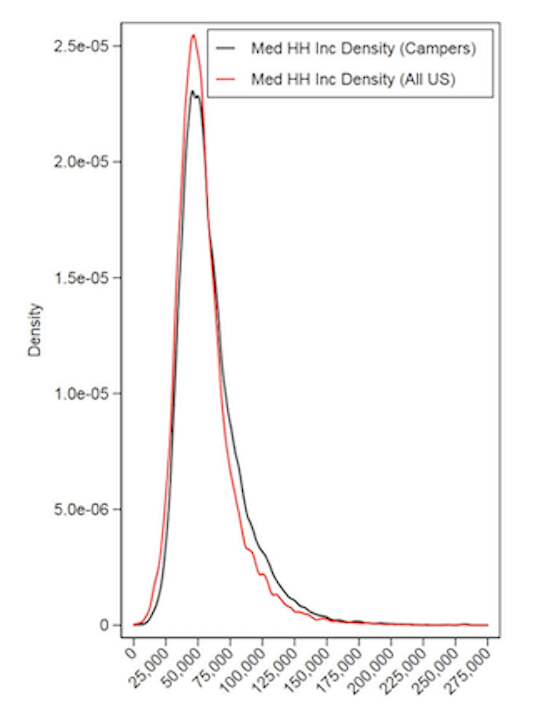

# Problem Statement

## Background

Outdoor recreation provides critical health and well-being benefits to communities, and in the United States, federal public lands play an important role in providing access to nature. However, access is not equal for all people @Ewert1990; @Flores2018, which has been recognized as an environmental injustice @Floyd2002. Many studies have shown that federally managed public land is accessed unequally due to historical discrimination and current inequities @Floyd2002; @Shelby1989; @Xiao2021. 

The challenge now facing public land management agencies is how to allocate quality visitor experiences to a more diverse user base. Simply increasing recreation opportunities on public land is not a viable solution to this rising demand. Many land management agencies in the U.S. are tasked with the dual mandate of providing recreational opportunities for visitors while also preserving and conserving natural resources and places @Shartaj2020. For over a century, striking the balance necessary to uphold this mandate has proven a challenge for federal agencies like the National Parks Service @Meinecke1937; @Sax1980, and the recent growth of recreation (Figure \@ref(fig:fig1)) has renewed concerns about its potential negative environmental impacts and changes to the visitor experience @Hammitt2015; @Timmons2019.

While managers seek to allocate existing resources (e.g. campsites) through the fairest means possible, including reservation systems, equal opportunities do not translate to equitable access @Shelby1989. Historically, policies of segregation barred certain racial groups from using federal public lands and the legacy of these policies has perpetuated inequitable access for certain racial groups to this day @Xiao2021. Additionally, previous and current inequities like lack of time, disposable income, access to technology, and lack of social or institutional knowledge about reservation systems impact access to federal public lands @Scott2018. At present, park visitation and camping are seeing a surge in popularity, heightened even more by the COVID-19 pandemic, and this rapid increase in demand for recreation opportunities may only further these inequities. 

## Significance

Currently, much of our understanding about trends in recreation on public lands comes from the [Integrated Resource Management Applications (IRMA) Portal](https://irma.nps.gov/Portal/), which the National Parks Service uses to monitor visitor counts over time @Bergstrom2020. However, these data lack information on where visitors are coming from. This project leverages the [Recreation Information Database (RIDB)](https://ridb.recreation.gov/landing), managed by Recreation One Stop, an inter-agency partnership that provides reservation services and trip-planning tools on [Recreation.gov](https://www.recreation.gov/). The RIDB is far more robust, including data from other land management agencies, and information on visitor zip codes, costs, group sizes, and dates of both reservations and recreation activities. While it is available for public download, there are few robust data-driven analytical tools to understand the patterns and relationships of these inequities within individual recreation areas. 

Previous research has demonstrated the value of RIDB data in forecasting future recreation demand for single park units @Rice2019 and analyzing preferential characteristics for popular recreational facilities @Rice2021. A recent study summarizing RIDB data from national parks @Walls2018 also identified broad patterns in reservations. For example, campsite reservations are made far in advance, but many are canceled last minute (Figure \@ref(fig:fig2)); visitors tend to visit national parks near their homes (Figure \@ref(fig:fig3)); and the distribution of incomes of campers appears to be similar to the U.S. population as a whole (Figure \@ref(fig:fig4)). However, overall, the vast RIDB data has received limited system-level research attention to date, and this work will be the first to explore issues of equity with RIDB data.

Furthermore, much of the existing research on outdoor recreation focuses on National Park Service lands (e.g., @Walls2018), which is only a small percentage of all federal land used by the public. The other land management agencies, including US Forest Service, Bureau of Land Management, and Army Corps of Engineers, often lack the capacity and funding to process reservation data, and are less frequently the subjects of outside research. Little is known about how patterns of access and demand vary across land management types. The RIDB includes data from all federal land management agencies, and therefore has tremendous promise to inform our understanding of patterns and trends in recreation across space and time and to inform policies for more equitable campground access for all federal public lands.

Our overarching objective for this project is to utilize data from RIDB and US Census to analyze spatial and demand patterns of visitor access at reservable overnight sites (such as campgrounds, cabins, hike-in, and more). We chose to focus on reservable sites since recent studies have shown this type of outdoor recreation to be a good proxy for visitation to federal public lands @Walls2018. These analyses will provide federal public managers an opportunity to explore relationships between and within socioeconomic and reservation variables.


## Figures

```{r, fig1, echo=FALSE, fig.cap = "Total annual visitors to the National Park Service system, since its inception through 2020. Visitation has been rapidly increasing, particularly within the last decade. (Source: [IRMA](https://irma.nps.gov/Portal/))"}
knitr::include_graphics("images/problem_statement_figure_1.png")
```

```{r, fig2, echo=FALSE, fig.cap = "Reproduced from @Walls2018. Days in advance that National Park campsite reservations are made from 2014 to 2016. Reservations are made far in advance, but many reservations are canceled at the last minute."}
knitr::include_graphics("images/problem_statement_figure_2.png")
```

```{r, fig3, echo=FALSE, fig.cap = "Reproduced from @Walls2018. Distance traveled and duration of stay for National Park camping visits from 2014 to 2016. Visitors tend to visit national parks near their homes and stay only two nights, and longer trips are rare."}
knitr::include_graphics("images/problem_statement_figure_3.png")
```

```{r, fig4, echo=FALSE, fig.cap = "Reproduced from @Walls2018. Median household income (by zip code) for National Park campers and for US Population. The black line estimates the distribution of median household (HH) income of campers from 2014 to 2016. The red line estimates the distribution of median household for all zip codes in the U.S. using average median household income from 2014 to 2016 where each zip code is an observation."}

```


